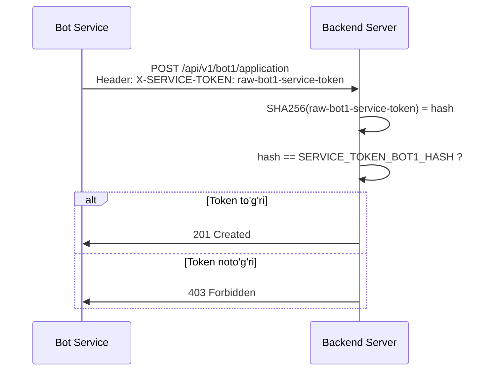

# Service Token Qo'llanma

## Service Token nima?

Service Token - bu **bot servislari** (bot1_service, bot2_service) va **backend server** o'rtasidagi xavfsiz autentifikatsiya mexanizmi. Bu tokenlar **service-to-service** (servisdan servisga) muloqotda foydalaniladi va tashqi foydalanuvchilar uchun emas.

## Majburiy kerakmi?

**Ha, majburiy**. Botlar serverga API so'rovlari yuborishda SERVICE_TOKEN talab qilinadi. Agar bu token bo'lmasa yoki noto'g'ri bo'lsa, server 403 Forbidden xatosini qaytaradi:

```
SERVICE_TOKEN_REQUIRED: X-SERVICE-TOKEN header is required.
SERVICE_TOKEN_INVALID: Invalid service token.
```

## Tokenlar ro'yxati

Loyihada **3 xil** service token ishlatiladi:

| Token nomi                | Joylashuvi          | Format           | Vazifasi                                  |
| ------------------------- | ------------------- | ---------------- | ----------------------------------------- |
| `SERVICE_TOKEN`           | `bot1_service/.env` | Raw (xom) string | Bot1 serverga so'rov yuborishda ishlatadi |
| `SERVICE_TOKEN`           | `bot2_service/.env` | Raw (xom) string | Bot2 serverga so'rov yuborishda ishlatadi |
| `SERVICE_TOKEN_BOT1_HASH` | `server/.env`       | SHA256 hash      | Server bot1 dan kelgan tokenni tekshiradi |
| `SERVICE_TOKEN_BOT2_HASH` | `server/.env`       | SHA256 hash      | Server bot2 dan kelgan tokenni tekshiradi |

**Muhim:** Bot1 va Bot2 har biri o'zining **alohida tokeniga** ega bo'lishi kerak (xavfsizlik uchun).

## Tokenlar qanday ishlaydi?

### 1. Autentifikatsiya jarayoni



### 2. Kod darajasida

**Bot service tomonidan** (`bot1_service/src/bot1_service/api.py`):

```python
headers = {"X-SERVICE-TOKEN": self.service_token}
response = await self.session.post(url, json=data, headers=headers)
```

**Server tomonidan** (`server/common/auth.py`):

```python
def verify_service_token(raw_token: str, service_name: str = None):
    # Bot yuborgan raw tokenni hash qilish
    incoming_hash = hashlib.sha256(raw_token.encode()).hexdigest()

    # .env dagi hash bilan solishtirish
    expected_hash = settings.SERVICE_TOKENS.get(service_name)  # bot1 yoki bot2

    if not hmac.compare_digest(incoming_hash, expected_hash):
        raise APIError(code="SERVICE_TOKEN_INVALID", status_code=403)
```

## Tokenlarni qanday sozlash kerak?

### 1-qadam: Raw token yaratish

Har bir bot uchun **mustaqil** va **murakkab** raw token yarating:

```bash
# Bot1 uchun
export BOT1_RAW_TOKEN="my-secret-bot1-token-$(openssl rand -hex 16)"
echo $BOT1_RAW_TOKEN

# Bot2 uchun
export BOT2_RAW_TOKEN="my-secret-bot2-token-$(openssl rand -hex 16)"
echo $BOT2_RAW_TOKEN
```

Yoki qo'lda:

```
Bot1: my-secure-bot1-token-2024
Bot2: my-secure-bot2-token-2024
```

**Xavfsizlik:** Production muhitida kamida 32 belgidan iborat, tasodifiy string ishlating.

### 2-qadam: Raw tokenni bot servisiga qo'yish

**`bot1_service/.env`** faylida:

```env
SERVICE_TOKEN=my-secure-bot1-token-2024
```

**`bot2_service/.env`** faylida:

```env
SERVICE_TOKEN=my-secure-bot2-token-2024
```

### 3-qadam: SHA256 hash yaratish

Raw tokenlarni hash qilib, serverdagi `.env` ga qo'ying:

```bash
# Bot1 tokenini hash qilish
echo -n "my-secure-bot1-token-2024" | sha256sum
# Output: 05a9e5b8bf881bca1cde81c079049e1842e1d3a3958ca4493da2532ba1153dfd

# Bot2 tokenini hash qilish
echo -n "my-secure-bot2-token-2024" | sha256sum
# Output: b6c7927026637fe7a3b9986de3c8e8e93362253632915189cf59287cc0104f36
```

Yoki Python bilan:

```bash
python - <<'PY'
import hashlib

bot1_token = "my-secure-bot1-token-2024"
bot2_token = "my-secure-bot2-token-2024"

print("Bot1 Hash:", hashlib.sha256(bot1_token.encode()).hexdigest())
print("Bot2 Hash:", hashlib.sha256(bot2_token.encode()).hexdigest())
PY
```

### 4-qadam: Hash qiymatlarini serverga qo'yish

**`server/.env`** faylida:

```env
SERVICE_TOKEN_BOT1_HASH=05a9e5b8bf881bca1cde81c079049e1842e1d3a3958ca4493da2532ba1153dfd
SERVICE_TOKEN_BOT2_HASH=b6c7927026637fe7a3b9986de3c8e8e93362253632915189cf59287cc0104f36
```

### 5-qadam: Sozlamalarni tekshirish

Barcha servislarni qaytadan ishga tushiring:

```bash
# Docker compose bilan
docker-compose down
docker-compose up --build

# Yoki alohida
cd server && poetry run python manage.py runserver
cd bot1_service && poetry run python -m bot1_service.main
cd bot2_service && poetry run python -m bot2_service.main
```

## Nimaga kerak?

### 1. Xavfsizlik

- Faqat vakolatli bot servislar backend API dan foydalanishi mumkin
- Raw token faqat bot service environmentida saqlanadi
- Server faqat hash qiymatni saqlaydi (agar .env leak bo'lsa ham, raw tokenni bilish qiyin)

### 2. Servis identifikatsiyasi

- Server qaysi bot dan so'rov kelganini biladi (`service_name=bot1` yoki `bot2`)
- Audit loglarida qaysi servis murojaat qilganini kuzatish mumkin

### 3. Tashqi API dan himoya

- Foydalanuvchilar token bilmasa, to'g'ridan-to'g'ri `/api/v1/bot1/application` ga so'rov yubora olmaydi
- JWT tokendan farqli - bu servislar uchun static token

## Misol: To'liq sozlash

### Production muhitida

**bot1_service/.env**:

```env
BOT_TOKEN=123456:ABC-real-telegram-token
SERVER_BASE_URL=http://server:8000/api/v1
SERVICE_TOKEN=PxK8mN4vQ2wE9rT7yU3iO6pL5sA1hJ0gF
DASHBOARD_EMAIL=admin@ttpu.uz
DASHBOARD_PASSWORD=StrongPass123!
DEFAULT_LANGUAGE=uz
CATALOG_CACHE_TTL=900
```

**bot2_service/.env**:

```env
BOT_TOKEN=789012:XYZ-real-telegram-token
SERVER_BASE_URL=http://server:8000/api/v1
SERVICE_TOKEN=ZxV7nM2bQ9wR4tY8uI5oP3lK6sD0hG1jF
DASHBOARD_EMAIL=admin@ttpu.uz
DASHBOARD_PASSWORD=StrongPass123!
```

**server/.env**:

```env
DJANGO_SECRET_KEY=very-secret-django-key
DJANGO_DEBUG=false
DJANGO_ALLOWED_HOSTS=localhost,127.0.0.1,server,0.0.0.0,ttpu.uz
CSRF_TRUSTED_ORIGINS=https://ttpu.uz,https://api.ttpu.uz

# Bot token hashlari
SERVICE_TOKEN_BOT1_HASH=e8f3a1b2c9d4e5f6a7b8c9d0e1f2a3b4c5d6e7f8a9b0c1d2e3f4a5b6c7d8e9f0
SERVICE_TOKEN_BOT2_HASH=a1b2c3d4e5f6a7b8c9d0e1f2a3b4c5d6e7f8a9b0c1d2e3f4a5b6c7d8e9f0a1b2

POSTGRES_DB=ttpu_crm
POSTGRES_USER=crm_user
POSTGRES_PASSWORD=SecureDatabasePass!
POSTGRES_HOST=db
POSTGRES_PORT=5432

JWT_COOKIE_SECURE=true
SECURE_SSL_REDIRECT=true
```

## Tez-tez so'raladigan savollar

### Q1: Raw token va Hash qiymatni qayerda saqlash kerak?

**A:**

- **Raw token** → `bot1_service/.env` va `bot2_service/.env` (xom string)
- **Hash qiymat** → `server/.env` (SHA256 hash)

### Q2: Agar tokenlar mos kelmasa nima bo'ladi?

**A:** Server 403 xatosi qaytaradi:

```json
{
  "error": {
    "code": "SERVICE_TOKEN_INVALID",
    "detail": "Invalid service token."
  }
}
```

Tekshirish:

```bash
# Bot1 tokenini hash qiling
echo -n "$(grep SERVICE_TOKEN bot1_service/.env | cut -d= -f2)" | sha256sum

# Server dagi HASH bilan solishtiring
grep SERVICE_TOKEN_BOT1_HASH server/.env
```

### Q3: Bot1 va Bot2 bir xil token ishlatishi mumkinmi?

**A:** Texnik jihatdan mumkin, lekin **tavsiya etilmaydi**. Xavfsizlik uchun har bir servis o'z tokeniga ega bo'lishi kerak. Agar bitta token buzilsa, faqat o'sha servisni o'zgartirish kerak.

### Q4: Tokenni qanday almashtirish kerak?

**A:**

1. Yangi raw token yarating
2. Yangi hash qiymatni hisoblang
3. Server va bot `.env` larini yangilang
4. Barcha servislarni qaytadan ishga tushiring

### Q5: Database da ServiceToken modeli ham bor, farqi nima?

**A:** Loyihada **2 xil** service token mexanizmi mavjud:

1. **Environment variables** (`.env`) - static, settings.py da o'qiladi
2. **ServiceToken model** (database) - dinamik, admin panel orqali boshqariladi, `expires_at`, `last_used_at` kabi metadatalarga ega

`verify_service_token()` funksiyasi **ikkalasini ham** tekshiradi - avval DB dan, keyin `.env` dan.

### Q6: Test muhitida qanday sozlash kerak?

**A:** Test uchun sodda qiymatlar ishlatish mumkin:

```bash
# server/tests/conftest.py yoki test faylida
@pytest.fixture
def service_tokens(settings):
    settings.SERVICE_TOKENS = {
        "bot1": hashlib.sha256(b"test-bot1-token").hexdigest(),
        "bot2": hashlib.sha256(b"test-bot2-token").hexdigest(),
    }
```

Test so'rovlarda:

```python
response = api_client.post(
    url,
    data=payload,
    HTTP_X_SERVICE_TOKEN="test-bot1-token"
)
```

## Xavfsizlik tavsiyalari

1. ✅ **Raw tokenni hech qachon git ga commit qilmang** - `.env` fayllari `.gitignore` da bo'lishi kerak
2. ✅ **Production da murakkab tokenlar ishlating** - kamida 32 belgili tasodifiy string
3. ✅ **Har bir servis uchun alohida token** - agar bitta buzilsa, boshqasi xavfsiz qoladi
4. ✅ **Tokenlarni munтazam yangilang** - masalan har 3-6 oyda
5. ✅ **Environment variables orqali yuboring** - hardcode qilmang
6. ✅ **HTTPS ishlatganda** - tokenlar tarmoqda shifrlangan holda o'tadi
7. ❌ **Hash qiymatni bot .env ga qo'ymang** - faqat raw token kerak
8. ❌ **Raw tokenni server .env ga qo'ymang** - faqat hash kerak

## Qo'shimcha ma'lumot

- [PROJECT_DOCUMENTATION.md](./PROJECT_DOCUMENTATION.md) - To'liq loyiha hujjati
- [server/common/auth.py](./server/common/auth.py) - Token verification kodi
- [server/common/models.py](./server/common/models.py) - ServiceToken modeli
- [bot1_service/README.md](./bot1_service/README.md) - Bot1 hujjati
- [bot2_service/README.md](./bot2_service/README.md) - Bot2 hujjati

---

**Tuzuvchi:** Loyiha hujjatidan generatsiya qilingan  
**Versiya:** 1.0  
**Yangilangan:** 2026-02-17
